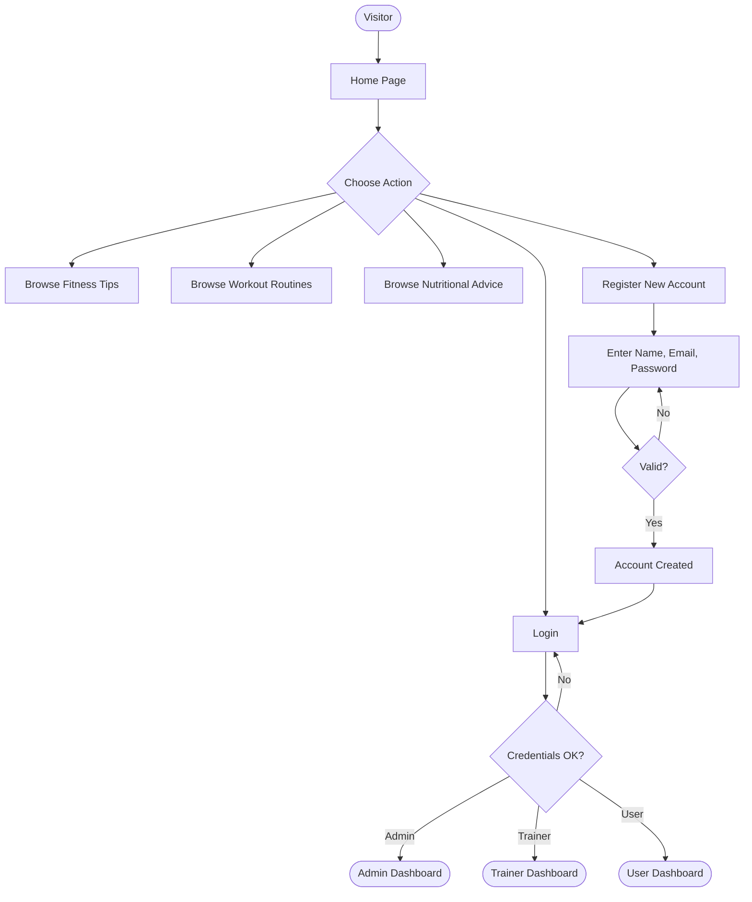
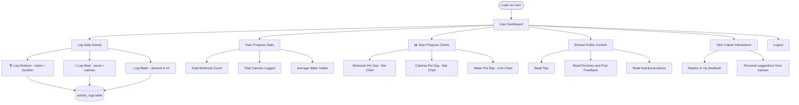
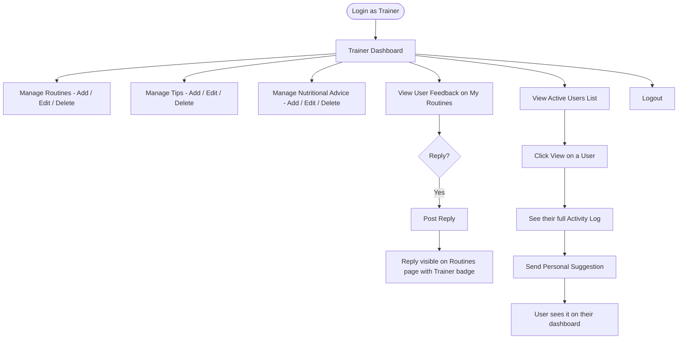
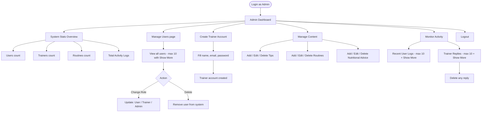

# Personal Fitness Tracker — Flowcharts

> Four role-specific flowcharts. Each one is independent and easy to follow.

---

## 🌐 1. Unregistered / Public User

---

## 👤 2. Registered User

---

## 🏋️ 3. Trainer

---

## 🔑 4. Admin

