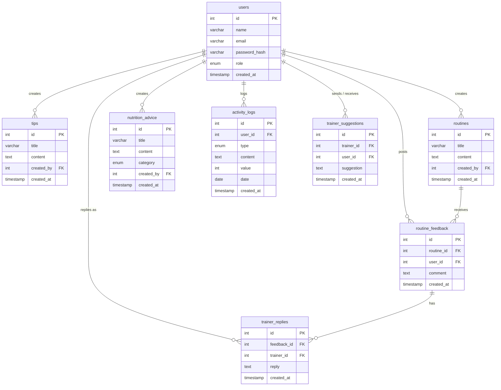

# Personal Fitness Tracker — Database Design, Schema & ERD

## Normalization: **3NF (Third Normal Form)**
All non-key attributes depend only on the primary key. No transitive dependencies. Roles stored as ENUM on `users` — no separate roles table needed at this scale.

---

## Table Definitions

### 1. `users`
All system actors: admin, trainer, registered user.
```sql
CREATE TABLE users (
    id            INT AUTO_INCREMENT PRIMARY KEY,
    name          VARCHAR(100)  NOT NULL,
    email         VARCHAR(150)  NOT NULL UNIQUE,
    password_hash VARCHAR(255)  NOT NULL,
    role          ENUM('admin','trainer','user') NOT NULL DEFAULT 'user',
    created_at    TIMESTAMP DEFAULT CURRENT_TIMESTAMP
);
```

---

### 2. `tips`
Public fitness tips (any type of health/workout advice).
```sql
CREATE TABLE tips (
    id         INT AUTO_INCREMENT PRIMARY KEY,
    title      VARCHAR(255) NOT NULL,
    content    TEXT         NOT NULL,
    created_by INT,
    created_at TIMESTAMP DEFAULT CURRENT_TIMESTAMP,
    FOREIGN KEY (created_by) REFERENCES users(id) ON DELETE SET NULL
);
```

---

### 3. `routines`
Public workout routines created by admin/trainer.
```sql
CREATE TABLE routines (
    id         INT AUTO_INCREMENT PRIMARY KEY,
    title      VARCHAR(255) NOT NULL,
    content    TEXT         NOT NULL,
    created_by INT,
    created_at TIMESTAMP DEFAULT CURRENT_TIMESTAMP,
    FOREIGN KEY (created_by) REFERENCES users(id) ON DELETE SET NULL
);
```

---

### 4. `nutrition_advice`
Public nutritional advice with category classification.
```sql
CREATE TABLE nutrition_advice (
    id         INT AUTO_INCREMENT PRIMARY KEY,
    title      VARCHAR(255) NOT NULL,
    content    TEXT         NOT NULL,
    category   ENUM('general','macros','vitamins','hydration','diet_plans','supplements')
               NOT NULL DEFAULT 'general',
    created_by INT,
    created_at TIMESTAMP DEFAULT CURRENT_TIMESTAMP,
    FOREIGN KEY (created_by) REFERENCES users(id) ON DELETE SET NULL
);
```

---

### 5. `activity_logs`
User daily activity records: workouts, meals, water.
```sql
CREATE TABLE activity_logs (
    id         INT AUTO_INCREMENT PRIMARY KEY,
    user_id    INT  NOT NULL,
    type       ENUM('workout','meal','water') NOT NULL,
    content    TEXT,
    value      INT DEFAULT 0,   -- mins / kcal / ml depending on type
    date       DATE DEFAULT CURRENT_DATE,
    created_at TIMESTAMP DEFAULT CURRENT_TIMESTAMP,
    FOREIGN KEY (user_id) REFERENCES users(id) ON DELETE CASCADE
);
```

---

### 6. `routine_feedback`
Comments/feedback posted by users on routines.
```sql
CREATE TABLE routine_feedback (
    id         INT AUTO_INCREMENT PRIMARY KEY,
    routine_id INT  NOT NULL,
    user_id    INT  NOT NULL,
    comment    TEXT NOT NULL,
    created_at TIMESTAMP DEFAULT CURRENT_TIMESTAMP,
    FOREIGN KEY (routine_id) REFERENCES routines(id)  ON DELETE CASCADE,
    FOREIGN KEY (user_id)    REFERENCES users(id)     ON DELETE CASCADE
);
```

---

### 7. `trainer_replies`
Replies by trainers/admin on routine feedback.
```sql
CREATE TABLE trainer_replies (
    id          INT AUTO_INCREMENT PRIMARY KEY,
    feedback_id INT  NOT NULL,
    trainer_id  INT  NOT NULL,   -- could be admin or trainer role
    reply       TEXT NOT NULL,
    created_at  TIMESTAMP DEFAULT CURRENT_TIMESTAMP,
    FOREIGN KEY (feedback_id) REFERENCES routine_feedback(id) ON DELETE CASCADE,
    FOREIGN KEY (trainer_id)  REFERENCES users(id)            ON DELETE CASCADE
);
```

---

### 8. `trainer_suggestions`
Personal fitness suggestions sent by trainers to specific users.
```sql
CREATE TABLE trainer_suggestions (
    id         INT AUTO_INCREMENT PRIMARY KEY,
    trainer_id INT  NOT NULL,
    user_id    INT  NOT NULL,
    suggestion TEXT NOT NULL,
    created_at TIMESTAMP DEFAULT CURRENT_TIMESTAMP,
    FOREIGN KEY (trainer_id) REFERENCES users(id) ON DELETE CASCADE,
    FOREIGN KEY (user_id)    REFERENCES users(id) ON DELETE CASCADE
);
```

---

## Entity-Relationship Diagram (ERD)



---

## Relationships Summary

| From | Relation | To | Description |
|---|---|---|---|
| `users` | 1 → Many | `tips` | Admin/Trainer creates tips |
| `users` | 1 → Many | `routines` | Admin/Trainer creates routines |
| `users` | 1 → Many | `nutrition_advice` | Admin/Trainer creates nutritional advice |
| `users` | 1 → Many | `activity_logs` | User logs daily activity |
| `users` | 1 → Many | `routine_feedback` | User posts feedback on routines |
| `users` | 1 → Many | `trainer_replies` | Trainer/Admin replies to feedback |
| `users` | 1 → Many | `trainer_suggestions` | Trainer sends suggestions; User receives |
| `routines` | 1 → Many | `routine_feedback` | Routine receives many feedbacks |
| `routine_feedback` | 1 → Many | `trainer_replies` | Feedback receives many replies |

---

## Normalization Notes

| Normal Form | Satisfied? | Reason |
|---|---|---|
| **1NF** | ✅ | All columns are atomic, no repeating groups |
| **2NF** | ✅ | Single-column PKs — no partial dependencies |
| **3NF** | ✅ | No transitive dependencies; role stored on `users`, not derived elsewhere |
